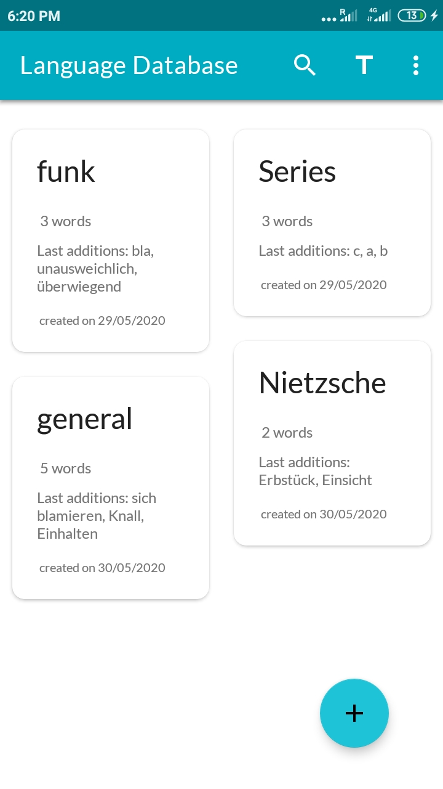
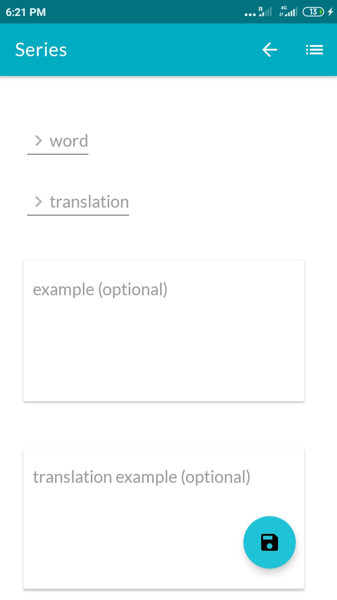
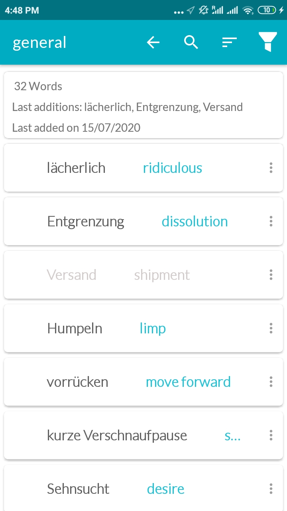
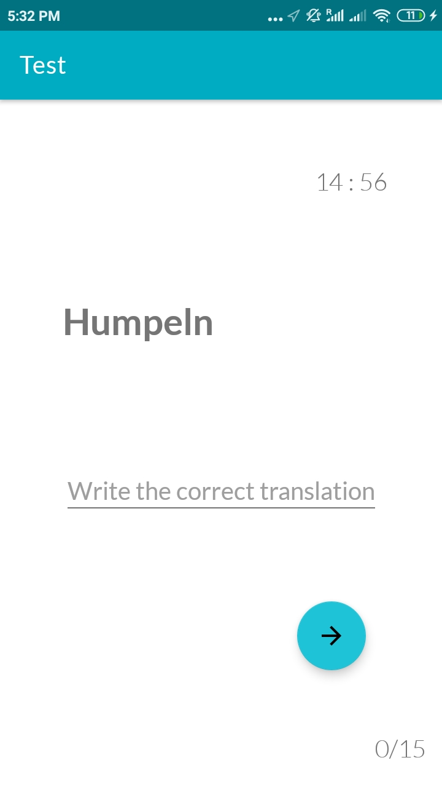
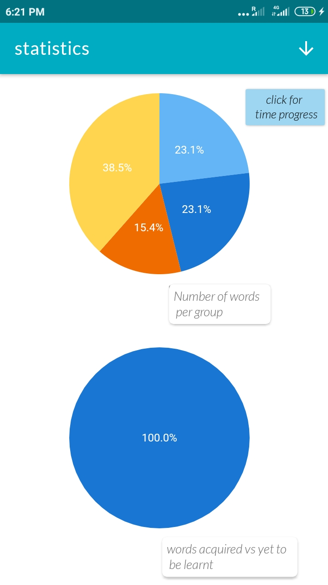
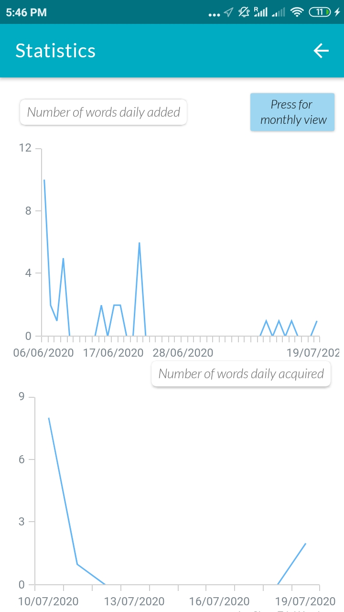

# LDB - LANGUAGE DATABASE 

## Welcome to the LDB repository!! 

 #### LDB is an app for android software designed in order to acquire new vocabulary of your target language.
 

With LDB, you will be able to store, classify, change and test your own words, phrases and examples you have captured in your daily life 

and you want to retain. With its minimalistic design and test algorithm, it will be easy for you to not only to learn new words but also

to mantain the knowledge over time . 

   

  

